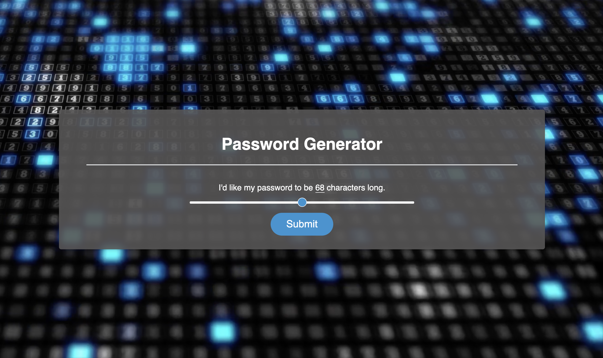

# Password Generator

## Description
This is an application to provide users with a unique, randomly-generated password based on selection criteria of their choosing. Users are prompted to provide the desired length of their password (8 to 128 characters, inclusive) as well as whether they'd like their password to include lowercase letters, uppercase letters, numeric values, or special characters.

## Deployed Application
[The deployed application can be found at this address.](https://rrcampbell-exe.github.io/js-pass-gen/)

## Screenshot of Deployed Application
